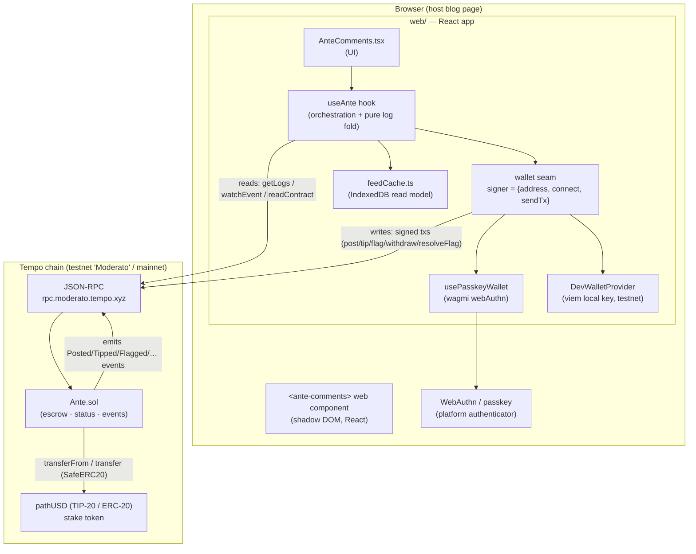

# Ante — Architecture

Ante is a **stake-and-slash, pay-to-comment dApp** built on the [Tempo](https://tempo.xyz)
chain. To leave a comment you post a small **refundable stablecoin stake**; if the
comment survives a challenge window you reclaim it (and can earn tips), and if it is
flagged-and-upheld the stake is **slashed**. There is no account, no login, and no real
identity — the system only ever sees a wallet address. **The bond is the reputation
system, priced in dollars instead of karma points.**

This document explains how the pieces fit together. For the full protocol mechanism see
[`SPEC.md`](../SPEC.md); for embedding on a site see [`web/EMBEDDING.md`](../web/EMBEDDING.md);
for the verified chain/wallet facts see [`docs/tempo-facts.md`](./tempo-facts.md); for the
security posture see [`docs/security-review.md`](./security-review.md).

---

## 1. Purpose & context

Most comment systems fight bad comments with **identity** (real names, logins) or
**moderation** (delete after the fact). Ante instead prices the thing that is underpriced
— the act of posting — with a **refundable economic bond**:

- **Sybil resistance is economic, not identity-based.** A funded wallet can post;
  throwaways are penalized by losing their stake. No KYC, no proof-of-personhood.
- **Anonymity via a pseudonymous, passkey-backed wallet.** The contract only ever sees an
  address. The reader signs in with a WebAuthn passkey (Face ID / Touch ID) — no browser
  extension, no seed phrase.
- **Why Tempo:** gas is paid in stablecoins (no volatile native token), fees are
  sub-millidollar, finality is sub-second, and it ships first-class passkey / embedded-wallet
  tooling. It is purpose-built for exactly this micropayment pattern.

**Stake** = the refundable bond an author escrows to post. **Slash** = a moderator routing
that stake to the treasury when a flag is upheld. **Flagging is *also* staked** — an accuser
bonds funds too, so grief-flagging is as costly as bad commenting (symmetric skin-in-the-game).

---

## 2. Component map

The repository has two shipping components plus the shared spec/tooling:

| Dir | Component | Language / stack | Role |
|---|---|---|---|
| [`contracts/`](../contracts) | `Ante.sol` | Solidity, Foundry, OpenZeppelin | **On-chain source of truth**: escrow, status, slashing, events |
| [`web/`](../web) | React widget + `<ante-comments>` embed | Vite + React + TS, viem + wagmi | Wallet, reads (log folding), writes (transactions), UI |
| [`docs/`](.), [`SPEC.md`](../SPEC.md) | Spec & research | Markdown | Protocol spec, verified Tempo facts, security review |
| [`Makefile`](../Makefile) | Command surface | Make | build / test / e2e / deploy / web-build / web-embed |

> **No backend on `main`.** There is *no* server or indexer component in the shipping app —
> the frontend reconstructs the entire feed directly from chain logs (see §5). A minimal
> Turnkey passkey backend (`server/`) and a Ponder-style indexer are documented **future
> work** (referenced in `README.md`/`AGENTS.md`), not part of the current architecture.



**How the parts talk:**

- **web ⇄ chain (reads):** viem `PublicClient` over HTTP RPC — `getLogs` /
  `watchEvent` for the event feed and `readContract` for token metadata and contract
  parameters (`minStake`, `challengeWindow`, `moderators(addr)`, …).
- **web ⇄ chain (writes):** the connected wallet signs raw calldata and sends it via
  the RPC. Both wallet backends normalize to one `sendTx({to,data,value?}) => hash` seam.
- **wallet ⇄ authenticator:** the passkey path drives a WebAuthn ceremony (Touch ID /
  Face ID) through the browser's platform authenticator — this is why the widget must be a
  web component and **not** a cross-origin iframe (WebAuthn is blocked in those).
- **contract ⇄ token:** `Ante.sol` pulls/returns the stake token with `SafeERC20`
  (`transferFrom` on post/tip/flag, `transfer` on withdraw/refund/slash).

---

## 3. On-chain / off-chain boundary

The design rule is: **the chain is the source of truth; everything off-chain is a
rebuildable read model.**

| Concern | Where it lives | Notes |
|---|---|---|
| Escrowed funds, comment status, moderator set | **On-chain** (`Ante.sol` storage) | Authoritative. `Comment`/`Challenge` structs, `totalEscrowed` accounting |
| Comment **text** | **On-chain event only** (`Posted.content`) | Storage keeps just `keccak256(content)` as an integrity anchor — content is cheap in a Tempo event, expensive in storage |
| The rendered comment **feed** | **Off-chain, client-side** | Folded from logs in `useAnte`, cached in **IndexedDB** (`feedCache.ts`) |
| Wallet / identity | **Off-chain** (passkey in the authenticator) | Contract sees only the resulting address |

Because content lives in events and the feed is folded client-side, there is **no database
to trust**: any client can reconstruct the exact same feed from genesis, and the on-chain
`contentHash` proves the emitted text was not tampered with.

---

## 4. Key flows, end to end

Real contract functions live in [`contracts/src/Ante.sol`](../contracts/src/Ante.sol); the
matching client writes live in [`web/src/hooks/useAnte.ts`](../web/src/hooks/useAnte.ts).

### 4.1 Post a comment

1. User types a comment and clicks **"Stake $X to post"** (`AnteComments.tsx`).
2. `useAnte.post(content, humanStake)` parses the amount using the token's live
   `decimals()` (pathUSD = 6), then `ensureAllowance()` reads `allowance(owner, ante)` and,
   only if insufficient, sends an ERC-20 `approve` (max allowance, so the user signs approve
   at most once per token).
3. It encodes `post(bytes32 topic, uint256 stake, string content)` and sends it via the
   wallet seam. `topic` scopes the comment to a thread — the embed uses
   `keccak256(slug)`, so each blog post gets its own feed.
4. `Ante.post` pulls the stake via `SafeERC20.transferFrom` (crediting the *actually
   received* amount, fee-on-transfer-safe), stores `keccak256(content)` + escrow bookkeeping,
   assigns a monotonic `id`, and **emits `Posted` with the full content string**.
5. The client `waitForTransactionReceipt`, then runs an incremental sync: the new `Posted`
   log is folded into the feed and the comment appears.

### 4.2 Read / list the feed (no backend)

1. On mount, `useAnte.loadComments()` hydrates the folded feed + last-synced block from
   IndexedDB (`loadFeedCache`).
2. It fetches only the **delta** since that block via `getLogs`, chunked into `logRange`
   windows (default 9000 blocks) to respect RPC `eth_getLogs` limits.
3. `applyBatch()` (a **pure**, module-level fold) applies the six event streams —
   `Posted`, `Withdrawn`, `Slashed`, `Tipped`, `Flagged`, `FlagResolved` — in
   `(blockNumber, logIndex)` order, reconstructing each comment's current `Status`
   (`Active` / `Withdrawn` / `Slashed` / `Challenged`) and accumulated tips.
4. The folded map is snapshotted newest-first, rendered, and persisted back to IndexedDB.
   A `watchEvent` subscription triggers a cheap incremental re-sync on any new Ante event.

### 4.3 Flag → resolve → slash (the challenge flow)

1. A reader clicks **flag** on an `Active` comment. `useAnte.flag(id, humanBond, reason)`
   `approve`s the bond token then calls `flag(uint256 id, uint256 bond, string reason)`.
2. `Ante.flag` escrows the flagger's bond, moves the comment to **`Challenged`**, opens a
   `Challenge` record, and blocks the author's withdrawal. One open challenge at a time.
3. A **moderator** (an address in the on-chain `moderators` mapping; the UI reveals the
   panel by reading `moderators(addr)`) calls `resolveFlag(uint256 id, bool uphold, string reason)`:
   - **uphold = true →** the comment is **slashed**: the flagger is refunded their bond
     **plus a bounty** (`flagBountyBps` of the stake), and the remainder goes to `treasury`.
     Status → `Slashed`.
   - **uphold = false →** the flagger **forfeits** their bond to `treasury`; the comment
     returns to `Active`.
4. Either way a `FlagResolved` (and, on uphold, `Slashed`) event fires; the client folds it
   and the status badge updates.

   A moderator can also **directly `slash(id, reason)`** an `Active` comment without a
   challenge, for clear-cut cases.

### 4.4 Withdraw

Once `block.timestamp > postedAt + challengeWindow` with no open challenge, and the
connected wallet is the author, the UI shows **"Reclaim stake."** `useAnte.withdraw(id)`
calls `withdraw(uint256 id)`, which returns the escrowed stake and sets status `Withdrawn`.

---

## 5. Persistence & read model

- **Now (serverless):** the frontend folds the feed from logs and caches it in IndexedDB
  (`web/src/cache/feedCache.ts`) with **incremental sync** — a returning visitor fetches
  only blocks since their last visit. Every cache op **fails soft**: if IndexedDB is
  unavailable (SSR, private mode, quota), reads return `null`, writes no-op, and the hook
  falls back to a full scan from the deploy block. A `rebuild()` hatch clears the cache and
  re-scans (recovery for a deep reorg or corrupted cache).
- **Cache key** is `chainId:anteAddress:topic`, so a redeploy, chain switch, or different
  per-post thread never reads stale state.
- **Later (documented, not built):** a small indexer (e.g. Ponder, co-located in a future
  `server/`) once feed volume outgrows client-side scanning; content can migrate to
  IPFS/Arweave with no contract change (emit a URI; the on-chain hash still proves integrity).

---

## 6. Layering — how the code is actually organized

> **Honest assessment (relevant to any architecture guard):** `web/` is **not** a
> directory-level hexagonal / ports-and-adapters codebase. It is a conventional React app
> organized **by technical role** (`abi/`, `cache/`, `components/`, `config/`, `embed/`,
> `hooks/`, `wallet/`). There is no `domain/` vs `adapters/` boundary, and the orchestration
> hook (`useAnte`) imports its concrete adapters (the wallet backends, `feedCache`, `viem`,
> the ABIs) directly rather than through an inverted port at the module boundary. See §8 for
> why no dependency-cruiser guard was added.

That said, there **is** one deliberate abstraction seam worth naming:

**The wallet "signer" port.** `useAnte` depends on a single structural interface —
`{ address, connect(), sendTx({to,data,value?}) => hash }` — and two swappable adapters
satisfy it:

- **`usePasskeyWallet`** (`web/src/wallet/usePasskeyWallet.ts`) — the production path: a thin
  hook over wagmi's Tempo **webAuthn** connector. Backendless; `connect()`/`sendTx()` drive
  a WebAuthn ceremony and must be called synchronously from a user click (transient
  activation).
- **`DevWalletProvider`** (`web/src/wallet/DevWalletProvider.ts`) — a testnet-only fallback:
  a viem local account from `VITE_DEV_PRIVATE_KEY`, so the app runs end-to-end without a
  passkey ceremony (used for local dev and CI's headless build). Selected iff a dev key is set.

The six write bodies in `useAnte` touch only that seam, so the wallet backend can change
without touching the transaction logic. The **read** path is separately isolated behind
`makePublicClient` (a viem `PublicClient`), and the **fold** logic (`applyBatch`,
`toSortedList`) is pure and module-level. Runtime config is threaded via `AnteConfig`
(`web/src/config/chain.ts`) so the same component code serves both the standalone Vite app
(env-derived defaults) and the embed (HTML-attribute-derived config).

**The contract is its own trust & execution layer.** `Ante.sol` is the authoritative
boundary: it enforces access control (`Ownable`, `moderators`), reentrancy protection
(`ReentrancyGuard`), fee-on-transfer-safe escrow accounting, and min-stake bounds. The
frontend is untrusted — it can only propose transactions the contract independently validates.

---

## 7. External integrations

| Integration | Detail | Source |
|---|---|---|
| **Tempo chain** | Testnet "Moderato" chain id **42431** (`0xa5bf`), RPC `https://rpc.moderato.tempo.xyz`, explorer `https://explore.testnet.tempo.xyz`. Mainnet chain id **4217**. | `web/src/config/chain.ts`, `docs/tempo-facts.md` |
| **Stake token** | **pathUSD** (TIP-20 / ERC-20-compatible), address `0x20c0…0000`, **6 decimals**. Faucet via `tempo_fundAddress` RPC. | `Makefile`, `docs/tempo-facts.md` |
| **Deployed `Ante`** | Live on Tempo testnet at [`0x353D262c31fEb296FF468905AA5C4dA59BE21345`](https://explore.testnet.tempo.xyz/address/0x353D262c31fEb296FF468905AA5C4dA59BE21345) (per `README.md`). The frontend takes it via `VITE_ANTE_ADDRESS` / the embed's `ante-address` attribute; the default is the zero address until configured. | `README.md`, `web/src/config/chain.ts` |
| **Wallet (passkey)** | Tempo's official wagmi **webAuthn** connector (`webAuthn` from `wagmi/tempo`, via the `accounts` SDK). **Backendless** — client-side WebAuthn, no API keys, no `authUrl`. | `web/src/wallet/AnteWeb3Provider.tsx`, `docs/tempo-facts.md` §4 |
| **Hardware wallet (deploy)** | For a real deploy the signer is an encrypted keystore/hardware account (`make deploy ACCOUNT=<keystore>` preferred over a raw `PRIVATE_KEY`). See the timelock/mainnet deploy runbook. | `Makefile`, `docs/timelock-deploy-runbook.md` |
| **Fee model** | Gas paid in stablecoins (no native gas token); a public testnet fee-sponsor service exists. viem still needs a `nativeCurrency` field — it's a **label only**, never used for amount math. | `web/src/config/chain.ts`, `docs/tempo-facts.md` |

---

## 8. Deployment

Everything is wrapped in the [`Makefile`](../Makefile) (`make help` lists targets; Foundry is
auto-added to `PATH`).

**Contract (Foundry → Tempo):**

```bash
make wallet                                    # generate a throwaway deployer key
make fund ADDR=0xYourDeployer                  # faucet pathUSD (gas is a stablecoin)
make deploy OWNER=0x.. TREASURY=0x.. \
  PRIVATE_KEY=0x.. CHALLENGE_WINDOW=120        # forge script Deploy.s.sol --broadcast
make verify ANTE=0xDeployed                    # cast-call sanity check
```

`OWNER` becomes the admin + first moderator; `TREASURY` receives slashed stakes and
forfeited bonds. Deploy exports the compiled ABI to `web/src/abi/Ante.json`. A
timelock-guarded path for a hardened/mainnet deploy is documented in
[`docs/timelock-deploy-runbook.md`](./timelock-deploy-runbook.md) (deploy via
`script/DeployTimelock.s.sol`).

**Web:**

```bash
make web-build    # standalone app (web/dist)
make web-embed    # <ante-comments> embed bundle (web/dist-embed/ante.js)
make cors-check   # confirm the RPC allows browser calls (needed for embedding)
```

The embed drops into any static site with one script tag (a complete Hugo/PaperMod example
lives in `web/examples/hugo/`); hosting, RPC CORS, and CSP are covered in
[`web/EMBEDDING.md`](../web/EMBEDDING.md).

**CI** ([`.github/workflows/ci.yml`](../.github/workflows/ci.yml)) runs on every PR:
`forge build --sizes` + `forge test -vvv`, **Slither** static analysis (gates on high-severity
findings — it's a live-money contract), and the web standalone + embed builds.

---

## 9. Key design decisions & tradeoffs

- **Bond, not a toll.** A pay-to-comment charge prices *speech* (taxes good contributors,
  lets anyone with money say anything, leaves the bad comment up). A refundable **bond**
  prices *bad behavior*: the good-faith commenter ultimately pays nothing, and the refund is
  what makes removal legitimate. A variable stake doubles as a confidence signal.
- **Symmetric staking.** Flagging is bonded too, so grief-flagging costs as much as bad
  commenting. Staking disciplines *who flags*; a moderator still adjudicates *who's right* —
  the correct trust model for a **personal blog** (you don't decentralize moderation of your
  own comment section). Its liveness cost — a negligent moderator could strand a
  `Challenged` author's funds — is a **known tradeoff**; a resolution-timeout auto-reject is
  documented future work, deliberately out of MVP scope.
- **Content in events, hash in storage.** Cheap on Tempo, keeps storage small, and makes the
  feed fully rebuildable while `contentHash` guarantees integrity.
- **No backend by default.** Client-side log folding + IndexedDB removes a trusted server
  from the MVP; an indexer is a scale-driven upgrade, not a prerequisite.
- **Web component over iframe.** Required for WebAuthn passkeys (blocked cross-origin);
  shadow DOM still gives CSS isolation in both directions.
- **Trust model.** Sybil resistance is economic (throwaways lose money), anonymity is
  pseudonymous-wallet, and the on-chain contract — not the frontend — is the enforcement
  boundary. Not yet audited; testnet only. See [`docs/security-review.md`](./security-review.md).
</content>
</invoke>
